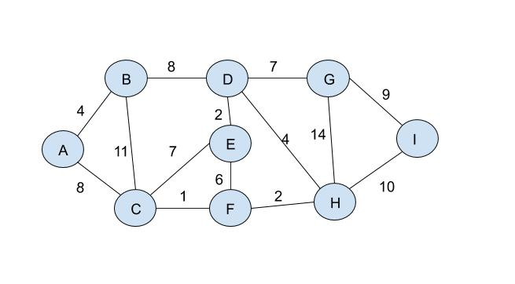

# Graph

Source: [Wikipedia](https://en.wikipedia.org/wiki/Graph_(abstract_data_type))

A graph data structure consists of a finite (and possibly mutable) set of vertices (also called nodes or points), together with a set of unordered pairs of these vertices for an undirected graph or a set of ordered pairs for a directed graph. These pairs are known as edges (also called links or lines), and for a directed graph are also known as arrows. The vertices may be part of the graph structure, or may be external entities represented by integer indices or references.

A graph data structure may also associate to each edge some edge value, such as a symbolic label or a numeric attribute (cost, capacity, length, etc.).

## Operation on Graphs

The basic operations provided by a graph data structure G usually include:

* adjacent(G, x, y): tests whether there is an edge from the vertex x to the vertex y;
* neighbors(G, x): lists all vertices y such that there is an edge from the vertex x to the vertex y;
* add_vertex(G, x): adds the vertex x, if it is not there;
* remove_vertex(G, x): removes the vertex x, if it is there;
* add_edge(G, x, y): adds the edge from the vertex x to the vertex y, if it is not there;
* remove_edge(G, x, y): removes the edge from the vertex x to the vertex y, if it is there;
* get_vertex_value(G, x): returns the value associated with the vertex x;
* set_vertex_value(G, x, v): sets the value associated with the vertex x to v.

Structures that associate values to the edges usually also provide:

* get_edge_value(G, x, y): returns the value associated with the edge (x, y);
* set_edge_value(G, x, y, v): sets the value associated with the edge (x, y) to v.

## Graph example

