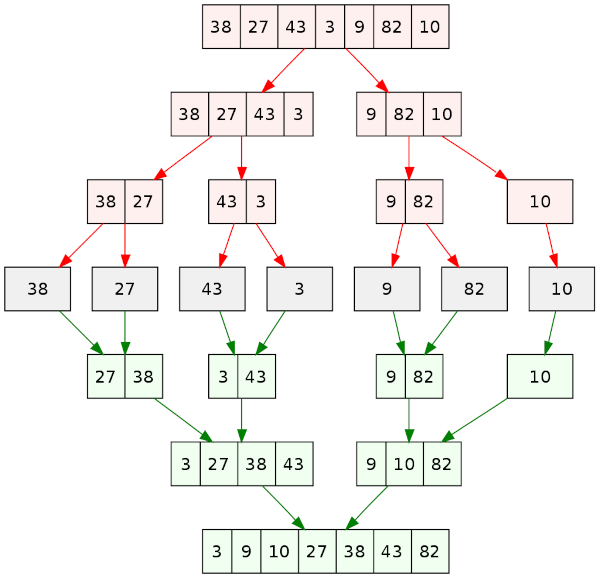

# Merge Sort

Source: [Wikipedia](https://en.wikipedia.org/wiki/Merge_sort)

Like QuickSort, Merge Sort is a Divide and Conquer algorithm. It divides the input array into two halves, calls itself for the two halves, and then merges the two sorted halves.

## Complexity

Worst Case Time Complexity [ Big-O ]: **O(n log n)**  
Best Case Time Complexity [Big-omega]: **O(n log n)**  
Average Time Complexity [Big-theta]: **O(n log n)**  
Space Complexity: **O(n)**

## Algorithm

* Divide the unsorted list into n sublists, each containing one element (a list of one element is considered sorted).
* Repeatedly merge sublists to produce new sorted sublists until there is only one sublist remaining. This will be the sorted list.

